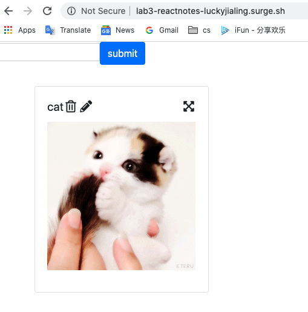
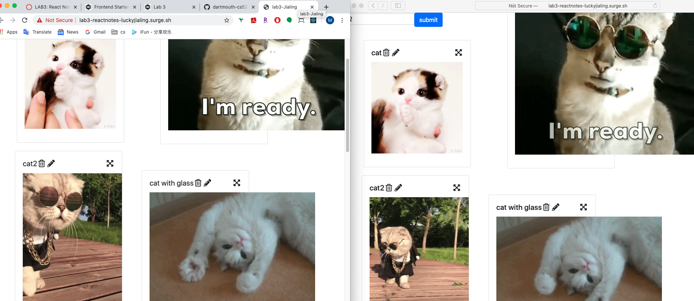

# About Lab3
github link: https://github.com/dartmouth-cs52-20S/lab3-reactnotes-luckyjialing

url: http://lab3-reactnotes-luckyjialing.surge.sh/
  
when you open the link, you could see a predefined note with a cute cat.

you can try with the **delete** icon, **edit** icon and **drag** icon to check if it works.

OK. Now you can change to safari or chrome or firefox and check about whether it works realtime.
